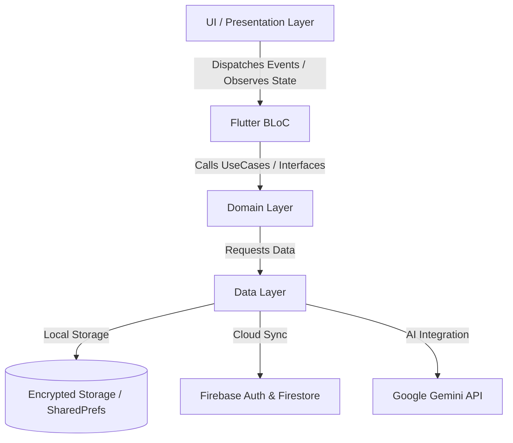

# VitalAI 🩺✨
> **Intelligent Health Companion & Vitals Tracking Ecosystem**

[](https://flutter.dev)
[](https://dart.dev)
[](https://blog.cleancoder.com/uncle-bob/2012/08/13/the-clean-architecture.html)
[](https://bloclibrary.dev)
[](https://ai.google.dev)
[](LICENSE)

VitalAI is a premium, high-aesthetic Flutter application crafted as an intelligent personal health companion. It combines robust local-first health vitals logging, trend analytics, custom reminders, caregiver monitoring, and a context-aware generative AI health assistant powered by Google Gemini.

---

## 📑 Table of Contents

- [🌟 Features](#-features)
- [🏗 Architecture & Design System](#-architecture--design-system)
- [📂 Directory Structure](#-directory-structure)
- [🛠 Tech Stack & Dependencies](#-tech-stack--dependencies)
- [🚀 Getting Started](#-getting-started)
- [🎨 Widgetbook Component Sandbox](#-widgetbook-component-sandbox)
- [🧪 Testing & Quality Assurance](#-testing--quality-assurance)
- [♿ Accessibility & Customization](#-accessibility--customization)
- [🤝 Contributing](#-contributing)
- [📜 License](#-license)

---

## 🌟 Features

### 🩺 1. Comprehensive Vitals Tracking
- **Multi-Metric Support**: Monitor Blood Pressure (Systolic/Diastolic), Blood Glucose, Heart Rate (BPM), Oxygen Saturation (SpO₂), Body Temperature, and Body Weight.
- **Auto-Calculated Analytics**: Automatic BMI calculation based on user biometric data.
- **Clinical Range Warnings**: Visual indicators and risk highlights for readings exceeding healthy thresholds.
- **Interactive Trend Charts**: High-performance 7-day and 30-day interactive analytics powered by `fl_chart`.
- **Export Clinical PDF Reports**: Generate, view, and share formatted health summary PDFs for healthcare providers.

### 🤖 2. Generative AI Health Assistant (Gemini)
- **Context-Aware Assistance**: Integrates Google Gemini to explain metrics, interpret physiological trends, and answer health questions.
- **Patient Context Integration**: Seamlessly attaches active patient profiles and recent vital logs to AI prompts for tailored insights.
- **Voice Input Support**: Speech-to-Text (`speech_to_text`) voice integration for hands-free querying.
- **Generative UI (GenUI)**: Renders dynamic, interactive UI widgets directly within AI response streams.
- **Rich Chat Controls**: Copy, reply, delete, and quick-prompt suggestions.

### 👥 3. Multi-Patient & Caregiver Portal
- **Caregiver Mode**: Manage multiple patient profiles, switch active patients, and view remote health statuses.
- **Patient Management**: Centralized records containing biometrics, medical history, and emergency contact info.

### ⏰ 4. Smart Reminders & Notifications
- **Custom Schedules**: Set precise, recurring reminders for medication, blood pressure checks, and glucose monitoring.
- **Cross-Platform Delivery**: Local notifications using `flutter_local_notifications` with timezone support.
- **Web Alert Simulator**: Custom in-app notification banner overlay for Web/Simulated environments.

### 🎨 5. State-of-the-Art Aesthetic Design System
- **Breathing Gradient Backgrounds**: Dynamic, smooth background canvas that subtly animates between ambient health states.
- **Glassmorphism UI**: Modern translucent cards, frosted inputs, and sleek borders.
- **High-Contrast Mode**: Built-in accessibility theme designed for low-vision users.

---

## 🏗 Architecture & Design System

VitalAI strictly adheres to **Clean Architecture** principles decoupled into distinct domain, data, and presentation layers per feature module:



### Key Architectural Highlights
- **Dependency Injection**: Powered by `GetIt` service locator (`lib/core/di/injection.dart`).
- **Declarative Routing**: Managed via `GoRouter` with deep linking and guard navigation (`lib/core/routing/router.dart`).
- **Feature-First Structure**: Modularity where each feature encompasses its own Domain, Data, and Presentation layers.

---

## 📂 Directory Structure

```
lib/
├── app.dart                  # Core MaterialApp entry point & MultiBlocProvider
├── main.dart                 # Application entry point with DI initialization
├── widgetbook.dart           # Widgetbook UI component sandbox catalog
├── core/
│   ├── database/             # Local database & encrypted storage service
│   ├── design_system/        # App themes, color tokens, typography & glassmorphism
│   ├── di/                   # Dependency injection setup (GetIt)
│   ├── extensions/           # Dart extension utilities (DateTime, String, Context)
│   ├── genui/                # Generative UI renderer components
│   ├── notifications/        # Notification scheduler & web alert simulator
│   ├── routing/              # GoRouter configuration & routes
│   ├── services/             # Firebase & Gemini service implementations
│   ├── theme/                # Light, Dark, & High-Contrast theme definitions
│   └── widgets/              # Reusable global widgets (buttons, cards, inputs)
├── features/
│   ├── ai_assistant/         # Gemini AI chat, speech-to-text, prompt cards
│   ├── auth/                 # Authentication BLoC, login, registration, social auth
│   ├── caregiver/            # Patient delegation & caregiver monitoring dashboard
│   ├── dashboard/            # Health overview summary & quick action shortcuts
│   ├── onboarding/           # Interactive setup wizard
│   ├── patients/             # Patient profile management & active patient switcher
│   ├── reminders/            # Medication & check-in reminder BLoC
│   ├── settings/             # Theme toggling, accessibility, high-contrast, API keys
│   └── vitals/               # Vitals logging, FL charts, PDF report generator
└── stories/                  # Widgetbook story definitions for UI components
```

---

## 🛠 Tech Stack & Dependencies

| Category | Package / Technology | Description |
| :--- | :--- | :--- |
| **Framework** | [Flutter](https://flutter.dev) (SDK ^3.12.1) | Cross-platform UI toolkit |
| **State Management** | [flutter_bloc](https://pub.dev/packages/flutter_bloc) / [bloc](https://pub.dev/packages/bloc) | Predictable state management pattern |
| **AI Integration** | [google_generative_ai](https://pub.dev/packages/google_generative_ai) | Gemini AI API SDK |
| **Voice Processing** | [speech_to_text](https://pub.dev/packages/speech_to_text) | Speech recognition engine |
| **Backend & Sync** | Firebase Auth, Firestore, Messaging | Authentication & Cloud Database |
| **Local Storage** | `flutter_secure_storage`, `shared_preferences` | Encrypted local storage |
| **Dependency Injection** | [get_it](https://pub.dev/packages/get_it) | Fast service locator |
| **Routing** | [go_router](https://pub.dev/packages/go_router) | Declarative navigation router |
| **Visualization** | [fl_chart](https://pub.dev/packages/fl_chart) | Interactive vitals trend charts |
| **Reports** | `pdf`, `printing` | Clinical document & PDF generation |
| **Component Sandbox** | [widgetbook](https://pub.dev/packages/widgetbook) | Isolated UI development environment |

---

## 🚀 Getting Started

### Prerequisites
- **Flutter SDK**: `^3.12.1` or higher
- **Dart SDK**: `^3.0.0` or higher
- **Android Studio** / **Xcode** or **VS Code** with Flutter extension

### Installation & Setup

1. **Clone the Repository**
   ```bash
   git clone https://github.com/inositols/vitalAI.git
   cd vitalai
   ```

2. **Install Dependencies**
   ```bash
   flutter pub get
   ```

3. **Configure Environment Variables / API Keys**
   Ensure your Firebase configuration (`lib/firebase_options.dart`) and Gemini API keys are configured. You can set your Gemini API key in the app Settings panel or via environment configuration.

4. **Run the Application**
   ```bash
   flutter run
   ```

---

## 🎨 Widgetbook Component Sandbox

VitalAI includes a built-in **Widgetbook** component catalog to preview and test UI components in isolation (Buttons, Cards, Charts, AI Chat Bubbles, Dialogs, Navigation elements).

To launch the Widgetbook storybook sandbox:

```bash
flutter run -t lib/main_widgetbook.dart
```

---

## 🧪 Testing & Quality Assurance

VitalAI maintains coverage across domain logic, BLoC state transitions, and UI widgets using `flutter_test`, `bloc_test`, and `mocktail`.

### Run All Unit & Widget Tests
```bash
flutter test
```

### Run Tests with Coverage Report
```bash
flutter test --coverage
```

---

## ♿ Accessibility & Customization

VitalAI is built with accessibility as a core feature:
- **High-Contrast Theme**: Toggle high-contrast light or dark themes tailored for low-vision readability.
- **Dynamic Text Scaling**: Responsive layout design supporting enlarged system font scaling.
- **Clear Visual Hierarchy**: Distinct color indicators for critical, warning, and normal vital ranges.

---

## 🤝 Contributing

Contributions are welcome! Please follow these steps:
1. Fork the project repository.
2. Create your feature branch (`git checkout -b feature/AmazingFeature`).
3. Commit your changes (`git commit -m 'Add some AmazingFeature'`).
4. Push to the branch (`git push origin feature/AmazingFeature`).
5. Open a Pull Request.

---

## 📜 License

Distributed under the **MIT License**. See `LICENSE` for more information.

---

<p align="center">
  Crafted with ❤️ for healthcare & human well-being.
</p>
